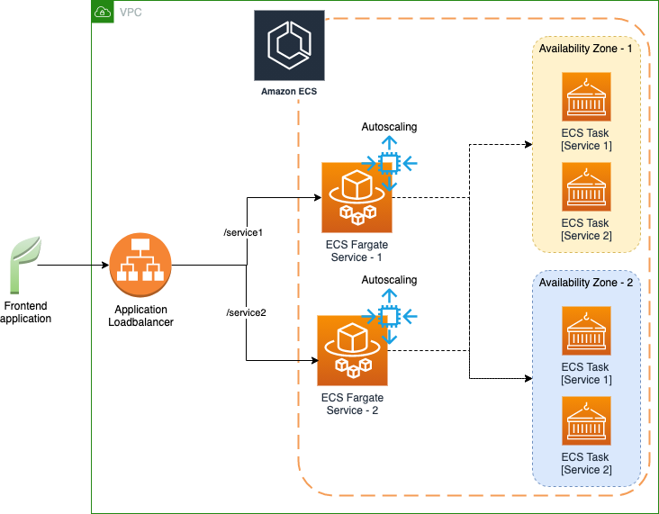

# Path based routing with ECS

## Overview



The diagram depicts how a typical microservice based architecture looks like when deployed in ECS, which consists of:

* Couple of microservices deployed as Fargate task inside different availability zones
* Path based routing enabled on load balancer listener so depending upon pattern corresponding services gets invoked
* Autoscaling enabled on each service level so tasks can scale up and down depending upon the load from front end application

Lets see how we can create this architecture using path based routing for “service1” AWS CLI and CDK

## Step by Step guide

#### Provision via AWS CLI

1. Create ECS Cluster

```bash
#Create cluster
aws ecs create-cluster \
--cluster-name FargateCluster \
--capacity-providers FARGATE FARGATE_SPOT
```

2. Create target group using the attached definition file [target-group.json](files/target-group.json)

```bash
#Create target group
aws elbv2 create-target-group --cli-input-json file://target-group.json
```

3. Create ECS Task using task definition file [task.json](files/task.json)

```bash
#Register task
aws ecs register-task-definition --cli-input-json file://task.json 
```

> Note: Make sure to replace "image", "taskRoleArn" and "executionRoleArn" attributes with the corresponding ARN values

4. Create ECS Service using the attached service definition file [service.json](files/service.json)

```bash
#Create service 1
aws ecs create-service --cluster Fargate-Cluster \
--service-name ECS_Load_Balancer_Service_1 --cli-input-json file://service.json
```

> Note: Make sure to replace “targetGroupArn”, “taskDefinition”, “subnets” and “securityGroups”  with corresponding values

5. Enable autoscaling for ECS service

```bash
#Setup service autoscaling
aws application-autoscaling register-scalable-target \
--service-namespace ecs \
--scalable-dimension ecs:service:DesiredCount \
--resource-id service/Fargate-Cluster/ECS_Load_Balancer_Service_1 \
--min-capacity 1 \
--max-capacity 10
```

6. Create a new Application Load balancer

```bash
#Create load balancer
aws elbv2 create-load-balancer --name my-load-balancer \
--subnets <<subnetIds>> \
--security-groups <<securitygroupIds>>
```

> Note: Make sure to replace “subnetIds” and “securitygroupIds” with corresponding values

7. Create listener to register target group

```bash
#Create listener to target group
aws elbv2 create-listener --load-balancer-arn <<loadbalancerARN>> \
--protocol HTTP --port 80 \
--default-actions Type=forward,TargetGroupArn=<<targetgroupARN>>
```

> Note: Make sure to replace “loadbalancerARN” and “targetgroupARN” with the corresponding ARN values

8. Create rule

```bash
#Create rule
aws elbv2 create-rule --listener-arn <<listenerARN>> --priority 1 \
--conditions Field=path-pattern,Values='/service1/*' \
--actions Type=forward,TargetGroupArn=<<targetgroupARN>>
```

> Note: Make sure to replace “listenerARN” and “targetgroupARN” with the corresponding ARN values

#### Provision via AWS CDK

```typescript
import * as cdk from '@aws-cdk/core';
import * as ecs from '@aws-cdk/aws-ecs';
import * as ec2 from '@aws-cdk/aws-ec2';
import * as elbv2 from '@aws-cdk/aws-elasticloadbalancingv2';

export class SampleStack extends cdk.Stack {
  constructor(scope: cdk.Construct, id: string, props?: cdk.StackProps) {
    super(scope, id, props);
    // VPC
    const vpc = new ec2.Vpc(this, "MyVpc", {
      maxAzs: 3
    });
    
    // Cluster
    const cluster = new ecs.Cluster(this, 'cluster', {
      clusterName:'EC2-Managed-Cluster-New',
      vpc: vpc
    }); 

    // Setup capacity providers
    const cfnEcsCluster = cluster.node.defaultChild as ecs.CfnCluster;
    cfnEcsCluster.capacityProviders = ['FARGATE', 'FARGATE_SPOT'];

    // Task and container definition
    const taskDefinition = new ecs.FargateTaskDefinition(this, 'TaskDef');
    const containerDefinition = taskDefinition.addContainer('DefaultContainer', {            
      image: ecs.ContainerImage.fromRegistry("amazon/amazon-ecs-sample"),
      memoryLimitMiB: 512,      
    });  

    // Port mapping
    containerDefinition.addPortMappings({
      containerPort:80,
      protocol: ecs.Protocol.TCP
    });

    // Setup Fargate service
    var service = new ecs.FargateService(this, "MyFargateService", {
      cluster: cluster, 
      taskDefinition: taskDefinition
    });
    
    // Set min & max capacity for autoscaling
    const scaling = service.autoScaleTaskCount({
      minCapacity:1,
      maxCapacity:10
    });
    
    // Setup up scaling policy
    scaling.scaleOnCpuUtilization('scale-on-cpu-utilization', {
      targetUtilizationPercent: 80
    });       

    // Setup Load balancer & register targets
    var loadBalancer = new elbv2.ApplicationLoadBalancer(this, 'app-lb', {
        vpc: vpc, 
        internetFacing:true  
    });
    
    // Default target routing
    const listener = loadBalancer.addListener('Listener', { port: 80 });
    service.registerLoadBalancerTargets({      
      containerName: 'DefaultContainer',
      containerPort: 80,
      newTargetGroupId: 'ECS',
      listener: ecs.ListenerConfig.applicationListener(listener, {
        protocol: elbv2.ApplicationProtocol.HTTPS,
        targets:[service]
      }),
    });
    
    // Path based routing
    listener.addTargets('service1', {
      priority: 10,
      conditions: [        
        elbv2.ListenerCondition.pathPatterns(['/service1']),
      ],
      port: 8080,
      targets: [service]
    });
  }
}
```

> Note: Path based routing is configured using `elbv2.ListenerCondition.pathPatterns(['/service1'])`
